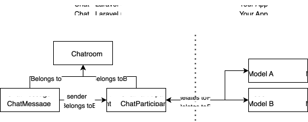

## Introduction
Laravel Chat is designed to be flexible and easy to integrate into your Laravel application.

## Laravel Chat and Your Application
Laravel Chat is built to work alongside your existing Laravel application. It can work on its own or work with your own models, allowing you to create a chat system that fits your needs.

The key concepts in Laravel Chat are:
- There is a `Chatroom` model that represents a place where messages and participants exist. A chatroom can have many `ChatParticipant`s and many `ChatMessage`s.
- There is a `ChatParticipant` model that represents a participant in a chatroom. A `ChatParticipant` can reference via morphing pretty much anything, but it doesn't have to. If its related to one of your models, your model becomes known as a `participant` in the chatroom.
- There is a `Message` model that represents a message in a chatroom. A message belongs to the sender `ChatParticipant`, and belongs to a `Chatroom`.

## All messages are in chatrooms
Laravel Chat does not have a concept of a direct message to another `ChatParticipant`. Instead, all messages are sent in the context of a chatroom.

This doesn't mean you cannot have direct messages, it just means you have to reframe your thinking a bit. If you want to send a direct message to another participant, you simply create a chatroom with just those two participants and send the message in that chatroom. As you'll see in the documentation, Laravel Chat makes this incredibly fluent, often not even requiring you to think about chatrooms themselves.

## Links to your models are internal
Laravel Chat uses the `ChatParticipant` model to represent a participant in a chatroom. This means you can have any model as a participant in a chatroom, and you don't need to modify your existing models to work with Laravel Chat. You can also forgoe linking your models to the `ChatParticipant` model if you don't need to, and just use the `ChatParticipant` model directly.

This also means that when you get data from [Broadcasting](/broadcasting) or using the provided [Routes](/routes), you will get the `ChatParticipant` model as the representations of the participants, not your own models. This gives you a uniform way to work with participants in chatrooms, regardless of the underlying model, and also seperates and protects your model data from the chat system.

In this documentation you can work fluently with your models or the `ChatParticipant` model, depending on the context and what you pass. On outgoing responses, you will always get the `ChatParticipant` model as the representation of the participant in a chatroom.

## Read receipts
LaravelChat uses a `read_at` timestamp on the `ChatParticipant` model to track up to which point in time the participant has read the messages in the chatroom.

This design decision was taken deliberately - keeping track of each individual message read by each participant would cause a huge amount of database writes, especially on large chatrooms with many participants. Instead, we track the last read time for each participant in a chatroom, and use that to determine which messages are new.

The performance of this design has much less impact on the database, but it does mean that you cannot track read receipts on a per-message basis. Instead, you can only track the last read time for each participant in a chatroom.